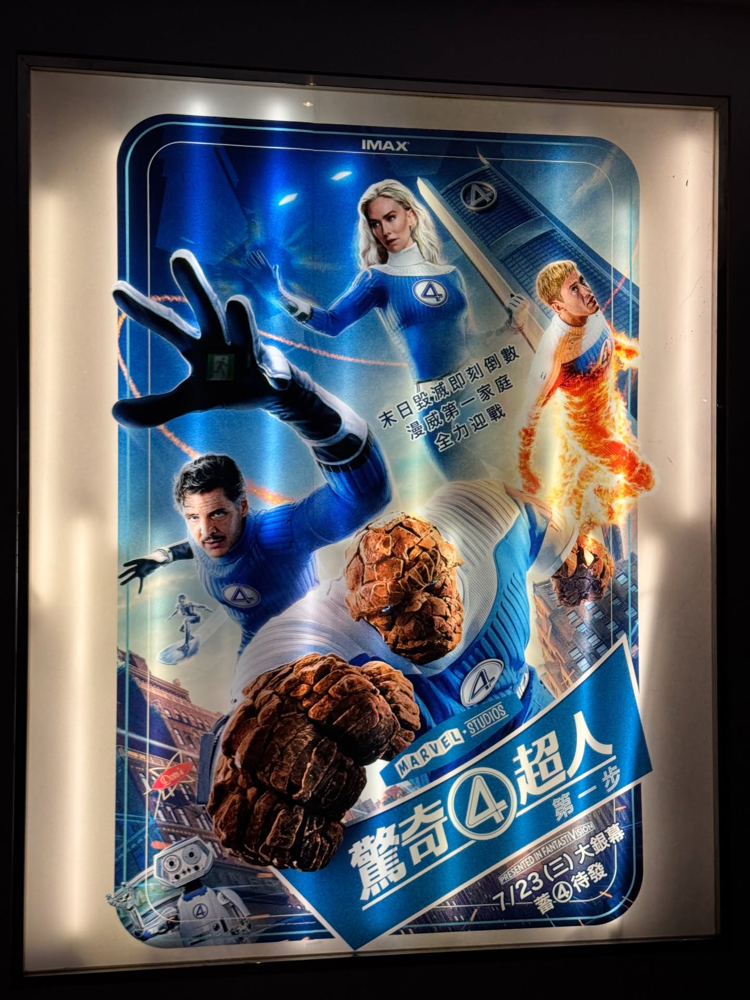

# 驚奇4超人：第一步

## 電影資訊
- **原名**: 驚奇4超人：第一步
- **年份**: 2025年
- **類型**: 英雄、冒險、漫威電影宇宙
- **觀看日期**: 2025年7月24日
- **我的評分**: 3/5 ⭐⭐⭐
- **推薦指數**: 3

我先說結論（來自我的主觀）
優秀的美術，
優秀的配樂，
優秀的雙主角，

無聊的劇情。

老實說，我覺得1994版，
扣除過時的美術，
讓人煩躁的B級笑料，
跟這個世代不喜愛的「非現實感」的超英片，
可能還勝過這一次重啟。

第一步，故事抽離於主宇宙的做法非常聰明，
但角色鋪陳非常的不足，
故事看得出骨架卻完全沒肉，
我覺得如果拍成影集，會好非常非常多。

全片我最愛的部分，
可能只有李德跟蘇的小小化學反應，
理性腦跟感性女的交戰這個最觸動我（？）
蘇真的是美，沒有話說。

嗯，就這樣。

2015的我直接跳過了所以無法比較。
至於那個隱藏片尾…
在末日博士演員宣布後，我就已不抱期待，
這次硬是要套入又只敢放一幕，更讓人擔心。

今年我的超英top還是給「超人」。